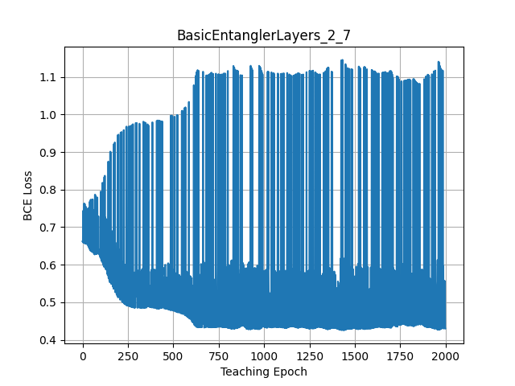
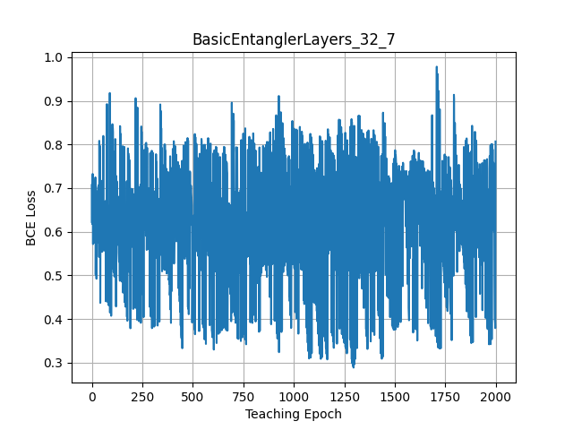

# q~~m~~usic: Quantum Music

This project is to use a **variational quantum circuit (VQC)** for music playing, inspired by a logo of [QHack 2022](https://github.com/XanaduAI/QHack).


<!--

-->


## Chord Ansatz

A user may give a **melody**, while we wish a VQC would generate a matched **harmony**. 
One simplest possibility is the use of specific **chords** depending on **notes** of the melody.

Let's consider 7-qubit quantum processor, where each qubit is associated with a piano string of C, D, E, F, G, A, and B notes at an octave 4.
Given a melody note, the quantum measurement may produce a chord; e.g., *C-major* chord given *C-note* melody.
Such chord ansatz may be realized by controlled-nots (**CNOTs**) like the figure below.


Given limited number of qubits, some may need to compromise with *'wrapped'* chords.
More qubits may be able to realize more variations (more octaves and flat/sharp strings).

Nevertheless, it should be noted that each chord ansatz will interfere each other, and thus we need more tricks.
You may see the interference when running [chord.py](./chord.py) with more chord ansatz.
```bash
python chord.py
C [1 1 1 1 0 0 1] # C-D-E-F-B ... anti-harmony
D [1 1 0 1 0 0 0] 
E [0 1 1 0 1 0 0]
F [0 0 1 1 0 1 0]
G [0 0 0 1 1 0 1]
A [1 0 1 0 0 1 0] # Am ... OK
B [0 1 0 1 0 0 1] # Bdm ... OK
```
Only exclusive chords in the end like a pair of Am and Bdm would work together.
For example, we may pick exclusive chord ansatzs like:
```bash
python chord.py --chords CM Dm
C [1 0 1 0 1 0 0] # CM ... OK
D [0 1 0 1 0 1 0] # Dm ... OK
E [0 0 1 0 0 0 0] # no harmony ... just melody of E-note.
```


## VQC Ansatz

The above CNOTs chord ansatz has no variational parameters, and less interesting. 
<!--
Can we make a cost Hamiltonian to realize chords, and then use [quantum approximate optimization algorithm (QAOA)](https://arxiv.org/abs/1411.4028)?
-->
In this project, we wish to design VQC to raise a *quantum pianist* or a *quantum guitarist* (hopefully with a passion to deviate from regular behaviors depending on his mood: i.e., quantum states/errors). 
Let's solve it with [**quantum machine learning (QML)**](https://pennylane.ai/qml/) framework.

## Prerequisite

We may use the package manager [pip](https://pip.pypa.io/en/stable/) for python=3.9.
We use [Pennylane](https://pennylane.ai/) for QML.
```bash
pip install pennylane=0.21.0
pip install pygame=2.1.2
pip install argparse
pip install dill=0.3.4
pip install tqdm=4.62.3
pip install matplotlib=3.5.1
```
Other versions should work.


## Sound Synthesis

We first synthesize sounds, based on a submodule [Synthesizer_in_Python](https://github.com/joaocarvalhoopen/Synthesizer_in_Python), licensec under [MIT](https://choosealicense.com/licenses/mit/).
A wrapper script [synth.py](synth.py) is to generate wav files in Sounds directory, e.g., for piano and guitar sounds as
```bash
python synth.py --octaves 4 --notes C D E F G A B --sound piano acoustic
```
We may hear a piano note like [C4.wav](./audios/C4.wav).

The synthesized sound may be checked with [twinkle.py](twinkle.py) as:
```bash
python twinkle.py --duration 0.1
```
You should hear *twinkle star* like [twinkle.mp4](./audios/twinkle.mp4), otherwise revisit above.

# q~~p~~iano: Quantum Piano


<!--


-->


## q~~m~~usician: Quantum Musician Ansatz

Let's invite three of our *qusicians*, who prefers a particular ansatzs:
- *qusician*-Alice: [BasicEntanglerLayers](https://pennylane.readthedocs.io/en/stable/code/api/pennylane.BasicEntanglerLayers.html)
- *qusician*-Bob: [StronglyEntanglingLayers](https://pennylane.readthedocs.io/en/stable/code/api/pennylane.StronglyEntanglingLayers.html)
- *qusician*-Charlie: [RandomLayers](https://pennylane.readthedocs.io/en/stable/code/api/pennylane.RandomLayers.html)

A *qusician* plays the piano based on a melody line, by embedding with [BasisEmbedding](https://pennylane.readthedocs.io/en/stable/code/api/pennylane.BasisEmbedding.html).
Our *qusician*-Charlie may look like below:
```python
wires = ['C', 'D', 'E', 'F', 'G', 'A', 'B'] # 1-octave strings
insights = np.random.randn(layer, 7, requires_grad=True) # variatinal param weights

@qml.device(device, wires=wires, shots=1)
def qusician(melody):
    # melody line given; 'C'-note for [1,0,0,0,0,0,0]
    qml.BasisEmbedding(features=melody, wires=wires)
    # think better harmony
    qml.RandomLayers(weights=insights, wires=wires)
    # type keyboard
    return qml.sample(wires=wires) # hope 'CM' chord [1,0,1,0,1,0,0] for 'C'-note melody
```

The *qusician* python class is introduced in [qusic.py](./qusic.py).
Our *qusician*-Charlie (with 2-layer insights) would visit us by calling as:
```python
python qusic.py --ansatz RandomLayers --layers 2 7
```

Note that, without teaching them, they are just novice-level players because the variational parameters are random at beginning. 
Also note that the tarent depends on how he/she thinks (i.e., quantum ansatz) and how deep his/her insights are (i.e., the number of quantum layers).
Let's introduce our *q~~m~~aestro* who may instruct them to play the piano.

## q~~m~~aestro: Quantum Maestro Teacher

Our *qaestro* teacher is introduced in [qaestro.py](./qaestro.py). 
He may use a particular teaching style, like [AdamOptimizer](https://pennylane.readthedocs.io/en/stable/code/api/pennylane.AdamOptimizer.html).
He tries to minimize students' *mis-fingering* (as a cost), where he asked how likely the students want to type keyboards given melody note, and judges a penalty, e.g., based on binary cross-entropy (BCE) loss, like below.
```python
qaestro = qml.AdamOptimizer() # different teaching style is available

def mis_finger(insights):
    melogy = np.random.choice(wires) # melody note given
    typing = qusician(melody, insights) # qusician answers melody typing
    harmony = chords[melody] # target harmony
    penalty = BCE(typing, harmony) # how much close to the target
    return penalty
insights = qaestro.step(mis_finger, insights) # qaestro's guide
```

## Teaching Perforamnce

### q~~m~~usician-Alice (BasicEntanglerLayers):

Let's see how *qusician*-Alice would be trained by our *qaestro*:
```bash
python qaestro.py --ansatz BasicEntanglerLayers --layers 2 7 --epoch 2000 --showfig
```
It saves the learning trajectry figure in **plots/BasicEntanglerLayers_2_7.png** in default setting.
Her skill is improved with large deviation as below.


After training, she looks like below:
```python
>> model.draw()
 C: ──RX(-6.88e-06)──╭C────────────────────────────────────────────────────────────────────────╭X──RX(-0.000264)──╭C──────────────────────╭X──┤ ⟨Z⟩ 
 D: ──RX(1.09e-05)───╰X──╭C───RX(2.09e-05)─────────────────────────────────────────────────────│──────────────────╰X──╭C──────────────────│───┤ ⟨Z⟩ 
 E: ──RX(-1.56)──────────╰X──╭C──────────────RX(-0.853)────────────────────────────────────────│──────────────────────╰X──╭C──────────────│───┤ ⟨Z⟩ 
 F: ──RX(-1.3)───────────────╰X─────────────╭C────────────RX(1.66)─────────────────────────────│──────────────────────────╰X──╭C──────────│───┤ ⟨Z⟩ 
 G: ──RX(1.36)──────────────────────────────╰X───────────╭C──────────RX(-2.37)─────────────────│──────────────────────────────╰X──╭C──────│───┤ ⟨Z⟩ 
 A: ──RX(-2.15)──────────────────────────────────────────╰X─────────╭C──────────RX(-0.000427)──│──────────────────────────────────╰X──╭C──│───┤ ⟨Z⟩ 
 B: ──RX(8.41e-05)──────────────────────────────────────────────────╰X─────────────────────────╰C──RX(-0.00425)───────────────────────╰X──╰C──┤ ⟨Z⟩ 
 ```
The trained model is saved in **models/BasicEntanglerLayers_2_7.pkl** in default.

Unfortunately, even with more deep thinking (32-layer ansatz), her skill seems not that great:
```bash
python qaestro.py --ansatz BasicEntanglerLayers --layers 32 7 --epoch 2000 --showfig
```


### q~~m~~usician-Bob (StronglyEntanglingLayers):

Let's check how our *quasician*-Bob would do:
```bash
python qaestro.py --ansatz StronglyEntanglingLayers --layers 2 7 --epoch 2000 --showfig
```


It seems that his skill is comparable to *qusician*-Alice.
However, he seems more serious in the piano training if he uses deeper insights with 32-layer ansatz:
```bash
python qaestro.py --ansatz StronglyEntanglingLayers --layers 32 7 --epoch 2000 --showfig
```


His playing looks more stable with less scolding by *qaestro*.
Note that [StronglyEntanglingLayers](https://pennylane.readthedocs.io/en/stable/code/api/pennylane.StronglyEntanglingLayers.html) have three-fold more variational parameters per layer than [BasicEntanglerLayers](https://pennylane.readthedocs.io/en/stable/code/api/pennylane.BasicEntanglerLayers.html).


## q~~m~~usician-Charlie (RandomLayers):

How skillful is our *qusician*-Charlie?
```bash
python qaestro.py --ansatz RandomLayers --layers 2 7 --epoch 2000 --showfig
```


His playing seems awful and receives a lot of penalty by *qaestro*.
However, we found that he would be more serious in the piano training if he considers deeper insights with 32-layer ansatz:
```bash
python qaestro.py --ansatz RandomLayers --layers 32 7 --epoch 2000 --showfig
```


Then, he may be more skillful than *qusician*-Alice, while the number of variational parameters is equivalent.

<!--
After training, he looks like below:
```python
>> model.draw()
 C: ──╭C───────────────RZ(-0.528)──RY(0.252)──RY(1.33)─────────────────────────────────────────────────────────────────────────────╭C───────────────────────╭C───────────╭X──RZ(0.293)─────RY(0.00413)──╭C──────────────────────────────────────────────╭X───RX(0.00563)───RY(-1.59)──────────────╭X──RY(0.503)───RY(0.817)─────────────────────────────────────────╭X──────────────╭C───────────────────────────────────────────────╭X───RY(-0.207)─────────────╭C──RX(1.07)────RX(0.5)─────RZ(-0.174)───────────RY(-0.133)──RZ(0.169)─────────────────────────────────────────────────────┤ ⟨Z⟩ 
 D: ──╰X───────────────RY(-1.58)───RZ(-3.13)─────────────╭X──RZ(0.591)──────────────╭X─────────────╭X─────────────╭C──RY(0.00162)──╰X───────────────────────│────────────╰C──RZ(-0.0107)───RX(-1.64)────│───────────────────────────────────────────────│───╭X─────────────RY(1.2)────RZ(1.12)────│───RY(0.742)──────────────────╭C─────────────────╭C──RY(0.681)───│───────────────│─────────────╭C──────────────────╭C──RY(-1.23)──│───╭X───────────RX(-1.21)──│───RY(0.727)───RZ(1.01)────────────────────╭X───RZ(0.151)───RY(0.0354)────RX(-0.675)─────RY(1.86)───RX(-1.19)──RY(0.649)──┤ ⟨Z⟩ 
 E: ───────────────╭X──RY(1.32)────RY(2.2)────RY(-0.31)──│───RY(0.77)────RZ(-1.51)──│───RZ(0.731)──│──────────────│─────────────────────────────────────────│────────────╭C──RZ(-0.681)───╭C────────────│──────────────────╭X──RX(1.56)─────RZ(-0.329)──│───╰C────────────╭X──────────────────────│──────────────────────────╭C──│───RX(0.775)──────│───RZ(0.4)─────│───RX(0.812)───│───RZ(1.23)──│───────────────╭X──│───RX(0.681)──│───│───────────────────────╰X──RY(0.497)───RY(-0.532)──────────────╭C──│────RZ(0.626)───RY(1.07)──────RZ(1.53)───────RX(-2.07)────────────────────────┤ ⟨Z⟩ 
 F: ───RX(1.56)────│───RZ(-1.59)─────────────────────────╰C──RY(-0.183)──RY(0.181)──│───RX(-1.99)──│───RX(-2.26)──│───RZ(2.58)──────────────────────────────│────────────│────────────────│─────────────│──────────────────│────────────────────────────│─────────────────│───────────────────────╰C──RZ(0.54)───────────────│───│──────────────╭X──│───RX(-0.945)──│───RY(-1.56)───│───RX(1.04)──│───RX(2.09)────│───│──────────────│───╰C───────────RZ(0.313)──────────────────────────────────────────│───│───╭X───────────RZ(-0.0744)───RY(-0.00282)───RZ(0.594)────────────────────────┤ ⟨Z⟩ 
 G: ───────────────╰C───────────────────────────────────────────────────────────────╰C─────────────│──────────────│─────────────────────────────╭C──────────╰X───────────╰X──RX(-1.54)────│─────────────╰X─────────────╭X──│────────────────────────────│───╭X────────────╰C──────────RZ(0.0243)──────RZ(-0.448)──RX(1.52)───│───│───RY(1.15)───│───│───────────────│───────────────│─────────────│───────────────╰C──│───RY(0.773)──│────RZ(-0.192)──RX(0.379)──────RZ(-0.623)──RY(0.801)───RY(-0.213)──│───│───╰C───────────RX(-0.0304)───RZ(0.315)───────────────────────────────────────┤ ⟨Z⟩ 
 A: ───RZ(-0.249)──────RX(-2.22)───────────────────────────────────────────────────────────────────╰C──RX(0.746)──│───RY(-0.828)────RY(-1.05)───╰X───────────RX(0.0455)──╭C───────────────│────────────────────────────╰C──│───RX(0.00595)──────────────╰C──╰C─────────────RX(1.61)───RZ(0.0447)──────RX(0.503)──────────────╰X──│──────────────│───╰X──RX(1.2)─────│───RY(-0.639)──│───RX(1.75)──│───RY(-0.833)──────│───RZ(-2.41)──│────RY(0.876)──────────────────────────────────────────────────────│───╰C───RY(0.778)───────────────────────────────╭X────────────────────────────────┤ ⟨Z⟩ 
 B: ───RZ(-0.384)─────────────────────────────────────────────────────────────────────────────────────────────────╰X──RZ(0.364)─────RZ(-0.903)───RZ(-1.15)───────────────╰X──RY(0.00567)──╰X─────────────RY(-0.00778)──────╰C──RZ(-1.52)─────────────────────────────────────────────────────────────────────────────────────────╰X─────────────╰C──────────────────╰C──────────────╰X────────────╰X──────────────────╰X─────────────╰C──────────────────────────────────────────────────────────────────╰X───────RY(0.743)───RX(-0.00879)──RZ(-0.00567)──╰C──────────RY(1.6)───────────────┤ ⟨Z⟩ 
```
-->

## q~~c~~oncert: Quantum Concert

Let's listen to how our *qusicians* Alice, Bob, and Charlie would play the piano for *twinkle star*.
Cour *qoncert* will be held by calling [qoncert.py](./qoncert.py) as follows (inviting a trained *qusician* model):
```bash
python qoncert.py --load models/RandomLayers_2_7.pkl
```
It saves **play.npy** and **play.wav** in default.
How good are they?
- *qusician*-Alice: [BasicEntanglerLayers_64_7.wav](./audios/BasicEntanglerLayers_64_7.mp4); umm, she mis-fingers at a break.
- *qusician*-Bob: [StronglyEntanglingLayers_64_7.wav](./audios/StronglyEntanglingLayers_64_7.mp4); he sounds good, at least knows when not to type keys at break.
- pre-training *qusician*-Bob: [StronglyEntanglingLayers_64_7_epoch0.wav](./audios/StronglyEntanglingLayers_64_7_epoch0.mp4); his playing was indeed improved when comparing with his past playing before *qaestro*'s instruction.
- *qusician*-Charlie: [RandomLayers_64_7.wav](./audios/RandomLayers_64_7.mp4); ... close but he still mis-fingers like Alice ...
- careless *qusician*-Charlie: [RandomLayers_1_7.wav](./audios/RandomLayers_1_7.mp4); nevertheless, his playing with deeper insights (64-layer) was indeed better than his playing with shallow thought (1-layer), as he is typing same keys most of the time regardless of melody line.

Not so great? Please do not blame them as our *qaestro* teacher does not play like a real maestro (qoncert.py --qaestro); [qaestro.mp4](./audios/qaestro.mp4). 
Also, they just spent a few minutes to learn how to play.
In addition, their playing may be still better than the orignal melody alone [twinkle.mp4](./audios/twinkle.mp4).


# q~~g~~uitar: Quantum Guitar


<!--

-->

Playing the guitar is similar but different from playing the piano. 
How to associate qubits with 6 strings and fingering?
Let's investigate it in detail someday, but for now let's just discuss different styles of **arpeggio** and **stroke** for playing the guitar.
Let our *qianists* play the guitar as *quitarists*:
```bash
python qoncert.py --verb --load models/StronglyEntanglingLayers_64_7.pkl --sound acoustic --delay 3000 --stroke 2
```
Here, *quitarist*-Bob uses slow 2-stroke arpeggio. 
Let's enjoy his *quitar* concert:
- [Rapid stroke (delay=100, stroke=1)](./audios/guitar100_StronglyEntanglingLayers_64_7.mp4); umm, not impressive
- [Slow stroke (delay=3000, stroke=1)](./audios/guitar3000_StronglyEntanglingLayers_64_7.mp4); sounds ok
- [Long wrapped stroke (delay=8000, stroke=1)](./audios/guitar8000_StronglyEntanglingLayers_64_7.mp4); interesting
- [Slow 2-stroke (delay=3000, stroke=2)](./audios/guitar3000x2_StronglyEntanglingLayers_64_7.mp4); feels good

Could be improved by adding more variants of arpeggio.

# Real QPU Validation

## IBM QPU
It is straightforward to use a real **quantum processing unit (QPU)** for testing our *qusic*.
For example, we may use [IBM Q Experience](https://pennylaneqiskit.readthedocs.io/en/latest/devices/ibmq.html).
You may specify the account token via [Pennylane configulation file](https://pennylane.readthedocs.io/en/latest/introduction/configuration.html), and a scpecific backend of real QPU, such as 'ibmq_london'.
To run our [qusic.py](./qusic.py) on a real quantum computer, you just need to change the device as follows:
```bash
pip install pennylane-qiskit=0.21.0 # qiskit plugin
python qusic.py --dev qiskit.ibmq
```

## AWS Braket

We can use different backends such as [Amazon braket](https://amazon-braket-pennylane-plugin-python.readthedocs.io/en/latest/).
For example, we may run as
```bash
pip install amazon-braket-pennylane-plugin=1.5.6 # AWS plugin
python qusic.py --dev braket.aws.qubit
```
Further examples and tutorials are found at [amazon-braket-example](https://github.com/aws/amazon-braket-examples) and [README](https://github.com/aws/amazon-braket-sdk-python/blob/main/README.md).


# Extensions

In future, our *quantum musicians* may consider:
- Volume
- Tempo/Pitch
- More chords/more strings
- Trend of melody
- Orchestra
- Reinforcement learning with rewards by social audiences
- Derivation of cost Hamiltonian for [QAOA](https://arxiv.org/abs/1411.4028)
- ...


# License

[MIT](https://choosealicense.com/licenses/mit/).
Copyright (c) 2022 Toshi Koike-Akino.
This project is provided 'as-is', without warranty of any kind. In no event shall the authors be liable for any claims, damages, or other such variants.

