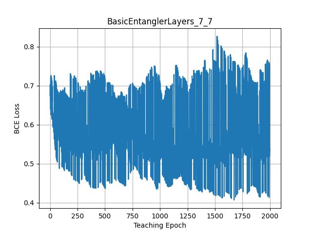
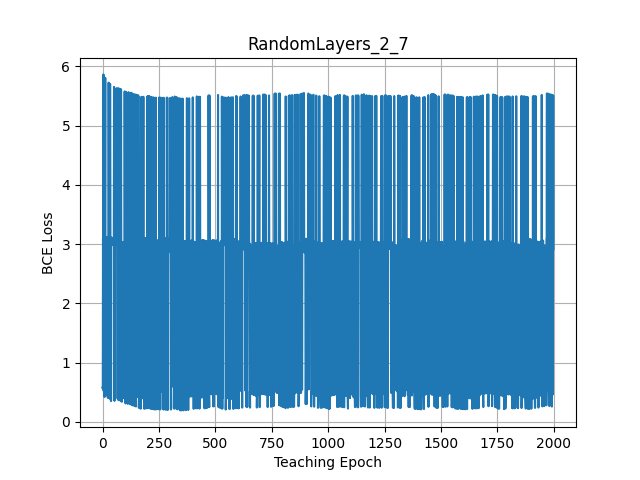

# q~~m~~usic: Quantum Music

This project is to use a **variational quantum circuit (VQC)** for music playing, inspired by a logo of [QHack 2022](https://github.com/XanaduAI/QHack).


<!--

-->


## Chord Ansatz

A user may give a **melody**, while we wish a VQC would generate a matched **harmony**. 
One simplest possibility is the use of specific **chords** depending on **notes** of the melody.

Let's consider 7-qubit quantum processor, where each qubit is associated with a piano string of C, D, E, F, G, A, and B notes at an octave 4.
Given a melody note, the quantum measurement may produce a chord; e.g., *C-major* chord given *C-note* melody.
Such chord ansatz may be realized by controlled-nots (**CNOTs**) like the figure below.


Given limited number of qubits, some may need to compromise with *'wrapped'* chords.
More qubits may be able to realize more variations (more octaves and flat/sharp strings).

Nevertheless, it should be noted that each chord ansatz will interfere each other, and thus we need more tricks.
You may see the interference when running [chord.py](./chord.py) with more chord ansatz.
```bash
python chord.py
C [1 1 1 1 0 0 1] # C-D-E-F-B ... anti-harmony
D [1 1 0 1 0 0 0] 
E [0 1 1 0 1 0 0]
F [0 0 1 1 0 1 0]
G [0 0 0 1 1 0 1]
A [1 0 1 0 0 1 0] # Am ... OK
B [0 1 0 1 0 0 1] # Bdm ... OK
```
Only exclusive chords in the end like a pair of Am and Bdm would work together.
For example, we may pick exclusive chord ansatzs like:
```bash
python chord.py --chords CM Dm
C [1 0 1 0 1 0 0] # CM ... OK
D [0 1 0 1 0 1 0] # Dm ... OK
E [0 0 1 0 0 0 0] # no harmony ... just melody of E-note.
```


## VQC Ansatz

The above CNOTs chord ansatz has no variational parameters, and less interesting. 
<!--
Can we make a cost Hamiltonian to realize chords, and then use [quantum approximate optimization algorithm (QAOA)](https://arxiv.org/abs/1411.4028)?
-->
In this project, we wish to design VQC to raise a *quantum pianist* or a *quantum guitarist* (hopefully with a passion to deviate from regular behaviors depending on his mood: i.e., quantum states/errors). 
Let's solve it with **quantum machine learning (QML)** framework.

## Prerequisite

We may use the package manager [pip](https://pip.pypa.io/en/stable/) for python=3.9.
We use [Pennylane](https://pennylane.ai/).
```bash
pip install pennylane=0.21.0
pip install pygame=2.1.2
pip install argparse
pip install dill=0.3.4
pip install tqdm=4.62.3
```
Other versions should work.


## Sound Synthesis

We first synthesize sounds, based on a submodule [Synthesizer_in_Python](https://github.com/joaocarvalhoopen/Synthesizer_in_Python).
A wrapper script [synth.py](synth.py) to generate wav files in Sounds directory, e.g., as
```bash
python synth.py --octaves 4 --notes C D E F G A B --sound piano acoustic
```
We may hear a piano note like [C4.wav](./audios/C4.wav).

Sound checking with [twinkle.py](twinkle.py) as:
```bash
python twinkle.py --duration 0.1
```
You should hear *twinkle star*, otherwise revisit above.

# q~~p~~iano: Quantum Piano


<!--


-->


## q~~m~~usician: Quantum Musician Ansatz

Let's invite three of our *qusicians*, who prefers a particular ansatzs:
- qusician-Alice: [BasicEntanglerLayers](https://pennylane.readthedocs.io/en/stable/code/api/pennylane.BasicEntanglerLayers.html)
- qusician-Bob: [StronglyEntanglingLayers](https://pennylane.readthedocs.io/en/stable/code/api/pennylane.StronglyEntanglingLayers.html)
- qusician-Charlie: [RandomLayers](https://pennylane.readthedocs.io/en/stable/code/api/pennylane.RandomLayers.html)

A *qusician* plays the piano based on a melody line, by embedding with [BasisEmbedding](https://pennylane.readthedocs.io/en/stable/code/api/pennylane.BasisEmbedding.html).
Our qusician-Charlie may look like below:
```python
wires = ['C', 'D', 'E', 'F', 'G', 'A', 'B'] # 1-octave strings
skill = np.random.randn(layer, 7, requires_grad=True) # skill weights

@qml.device(device, wires=wires, shots=1)
def qusician(melody):
    # melody line given; 'C'-note for [1,0,0,0,0,0,0]
    qml.BasisEmbedding(features=melody, wires=wires)
    # think better harmony
    qml.RandomLayers(weights=skill, wires=wires)
    # type keyboard
    return qml.sample(wires=wires) # hope 'CM' chord [1,0,1,0,1,0,0] for 'C'-note melody
```

The *qusician* python class is introduced in [qusic.py](./qusic.py).
Our qusician-Charlie would visit us by calling as:
```python
python qusic.py --ansatz RandomLayers --layers 2 7
```

Note that, without teaching them, they are just novice-level players because the variational parameters are random at beginning. 
Also note that the tarent depends on quantum ansatz and the number of layers.
Let's introduce our q~~m~~aestro who may instruct them to play the piano.

## q~~m~~astro: Quantum Maestro Teacher

Our *qaestro* teacher is introduced in [qaestro.py](./qaestro.py). 
He may use a particular teaching style, like [AdamOptimizer](https://pennylane.readthedocs.io/en/stable/code/api/pennylane.AdamOptimizer.html).
He tries to minimize students' *mis-fingering* (as a cost), where he asked how likely the students want to type keyboards given melody note, and judges a penalty based on binary cross-entropy (BCE) loss, like below.
```python
qaestro = qml.AdamOptimizer() # different teaching style is available

def mis_finger(weights):
    melogy = np.random.choice(wires) # melody note given
    typing = qusician(melody) # qusician answers melody typing
    harmony = chords[melody] # target harmony
    penalty = BCE(typing, harmony) # how much close to the target
    return penalty
weights = qaestro.step(mis_finger, weights) # qaestro's guide
```

## Teaching Perforamnce

### qusician-Alice (BasicEntanglerLayers):

Let's see how qusician-Alice would be trained by our qaestro:
```bash
python qaestro.py --ansatz BasicEntanglerLayers --layers 2 7 --epoch 2000
```
Her skill is improved with some deviation as below.


Unfortunately, even with 7-layer ansatz, her skill seems not that great:
```bash
python qaestro.py --ansatz BasicEntanglerLayers --layers 7 7 --epoch 2000
```


### qusician-Bob (StronglyEntanglingLayers):

Let's check how our quasician-Bob would do:
```bash
python qaestro.py --ansatz StronglyEntanglingLayers --layers 2 7 --epoch 2000
```


It seems that his skill is comparable to qusician-Alice.
However, he seems more serious in the piano training if he uses 7-layer ansatz:
```bash
python qaestro.py --ansatz StronglyEntanglingLayers --layers 7 7 --epoch 2000
```


## qusician-Charlie (RandomLayers):

<!--
Surprisingly, we found that our qusician-Charlie is more skillful as follows:
```bash
python qaestro.py --ansatz RandomLayers --layers 2 7 --epoch 2000
```


He achieves nearly zero penalty by qaestro's instruction (just with about 250 scoding)!

After training, he looks like below:
```python
>> model.draw()
 C: ──╭C───────────────RZ(-0.528)─────────────────────────────────────────────┤ ⟨Z⟩ 
 D: ──╰X───────────────RY(-4.09e-07)──RZ(-3.11)────────────╭X──RZ(1.46)───────┤ ⟨Z⟩ 
 E: ───────────────╭X──RY(0.323)──────RY(1.2)────RY(-1.3)──│───RY(-0.223)─────┤ ⟨Z⟩ 
 F: ───RX(3.14)────│───RZ(-1.57)───────────────────────────╰C──RY(-5.76e-06)──┤ ⟨Z⟩ 
 G: ───────────────╰C─────────────────────────────────────────────────────────┤ ⟨Z⟩ 
 A: ───RZ(-0.249)──────RX(5.62e-07)───────────────────────────────────────────┤ ⟨Z⟩ 
 B: ───RZ(-0.384)─────────────────────────────────────────────────────────────┤ ⟨Z⟩ 
```
-->

## q~~c~~oncert: Quantum Concert

Let's listen to how our *qusician* Alice, Bob, and Charlie would play the piano.
... Coming soon.


# q~~g~~uitar: Quantum Guitar


<!--

-->

Under development.

# Extensions

Our *quantum musician* may consider if he feels good:
- Volume
- Tempo 
- Arpeggio/Stroke
- Trend of melody
- ...

# License

[MIT](https://choosealicense.com/licenses/mit/).
Copyright (c) 2022 Toshi Koike-Akino.
This project is provided 'as-is', without warranty of any kind. In no event shall the authors be liable for any claims, damages, or other such variants.
